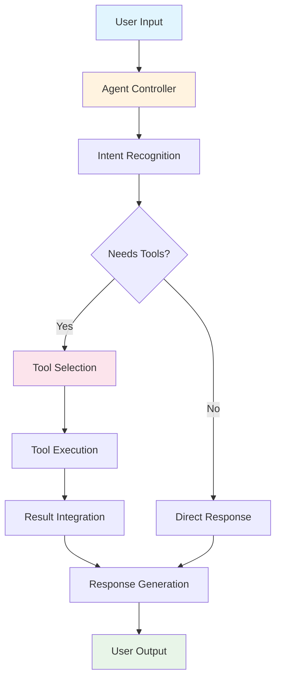
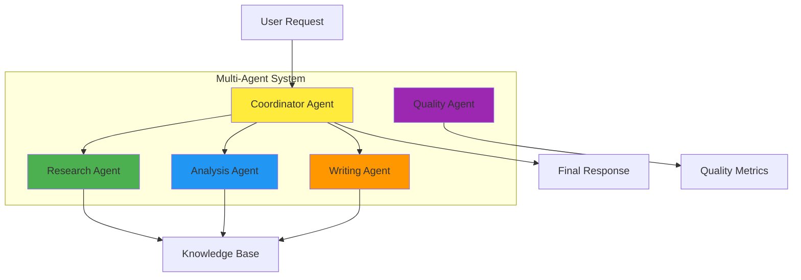
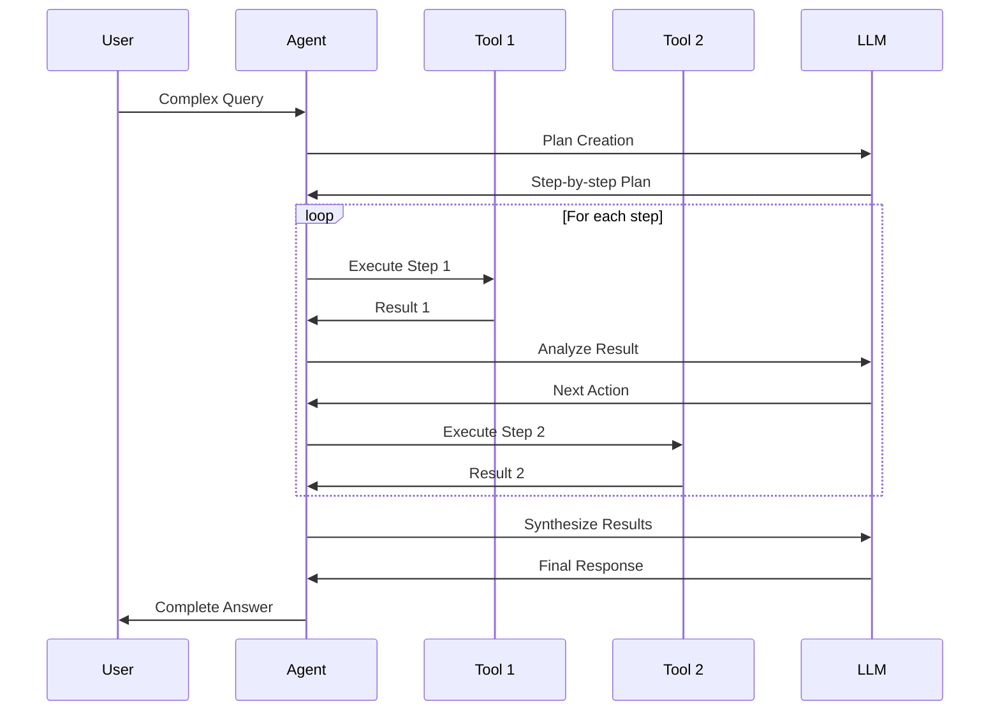
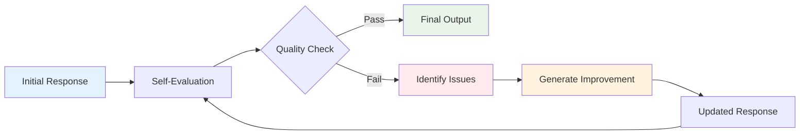

# Agents and Agentic Workflows with LLMs - Complete Tutorial

## Table of Contents
1. [Introduction to Agents](#introduction-to-agents)
2. [The Idea Behind Agents](#the-idea-behind-agents)
3. [Types of AI Agents](#types-of-ai-agents)
4. [Agentic Design Patterns](#agentic-design-patterns)
5. [Agent Architecture Diagrams](#agent-architecture-diagrams)
6. [Business Use Cases and Limitations](#business-use-cases-and-limitations)
7. [Agent Implementation Walkthrough](#agent-implementation-walkthrough)
8. [LangChain Agent Examples](#langchain-agent-examples)
9. [Best Practices and Tips](#best-practices-and-tips)

---

## Introduction to Agents

**What is an AI Agent?**

An AI Agent is an autonomous system that can perceive its environment, make decisions, and take actions to achieve specific goals. Unlike traditional LLM interactions that are single-turn question-answer exchanges, agents can:

- Plan multi-step approaches to complex problems
- Execute actions using external tools
- Reflect on their performance and adjust strategies
- Maintain context across multiple interactions
- Collaborate with other agents

> **💡 TIP:** Think of agents as digital assistants that can actually *do* things, not just *tell* you what to do.

---
## Difference between LLM and AI Agents.


| Feature/Aspect              | LLM (Large Language Model)                         | AI Agent                                             |
|----------------------------|----------------------------------------------------|------------------------------------------------------|
| 🧠 Core Functionality       | Text generation, summarization, translation, Q&A   | Autonomous task execution using tools + context     |
| 🎯 Goal                    | Respond accurately to input prompts                | Achieve specific goals with minimal human input      |
| 🧩 Input/Output Style       | Stateless prompt → response                        | Stateful loop: observe → plan → act → learn          |
| 🧰 Tool Usage               | Limited or none (unless instructed explicitly)     | Integrates with tools (APIs, databases, browsers)    |
| 🧠 Memory/Context           | Short-term context window                         | Long-term memory, contextual grounding               |
| 🔄 Autonomy                | Reactive, responds to prompts                     | Proactive, plans and executes sequences              |
| 🔧 Architecture            | Single model inference                            | Orchestration of LLMs, tools, memory, reasoning loop |
| 🕹️ Human Involvement       | Requires constant prompting                        | Minimal prompting, works towards goals independently |
| 📦 Example Use Case        | Write a paragraph about climate change             | Research a topic, extract data, generate report      |
| ⚡ Popular Frameworks       | OpenAI GPT, Anthropic Claude, LLaMA, Gemini        | AutoGPT, LangGraph, CrewAI, MetaGPT, OpenAgents      |
| 🔐 Security Consideration  | Prompt injection, misuse of model                 | Tool misuse, sandboxing, permission control          |

---

## Types of AI Agents

### 1. **Reactive Agents**
Simple agents that respond directly to stimuli without complex reasoning.

```
Input → Simple Processing → Output
```

**Characteristics:**
- No memory of past interactions
- Rule-based responses
- Fast and efficient
- Limited problem-solving capability

**Example Use Cases:**
- Chatbots with predefined responses
- Simple recommendation systems
- Basic content filtering

### 2. **Deliberative Agents**
Agents that plan and reason about their actions before executing them.

```
Input → Planning → Reasoning → Action → Output
```

**Characteristics:**
- Maintain internal state
- Create and execute plans
- Can adapt strategies
- More complex but powerful

### 3. **Hybrid Agents**
Combine reactive and deliberative approaches for optimal performance.

```
Input → [Reactive Layer + Deliberative Layer] → Output
```

**Characteristics:**
- Fast reactive responses for simple tasks
- Deep reasoning for complex problems
- Balanced performance
- Production-ready architecture

### 4. **Collaborative Agents**
Multiple agents working together to solve complex problems.

```
Agent A ↔ Agent B ↔ Agent C
    ↓       ↓       ↓
    Shared Knowledge Base
```

**Characteristics:**
- Specialized expertise
- Information sharing
- Distributed problem-solving
- Scalable architecture

### 5. **Learning Agents**
Agents that improve their performance over time through experience.

```
Experience → Learning → Updated Model → Better Performance
```

**Characteristics:**
- Continuous improvement
- Adaptation to new scenarios
- Performance optimization
- Long-term value creation

---

## Agent Architecture Diagrams

### Basic Agent Architecture



### Multi-Agent System Architecture



### Agentic Workflow Pattern



### Reflection Pattern Flow



---

## The Idea Behind Agents

### Reasoning Behind Combining Multiple Chained LLM Calls with External Tools

#### The Limitations of Single LLM Calls

Traditional LLM usage involves a single prompt → response cycle:

```
User: "What's the weather in New York and should I wear a jacket?"
LLM: "I don't have access to current weather data..."
```

#### The Agent Approach

Agents break complex tasks into manageable steps:

```
1. User Query: "What's the weather in New York and should I wear a jacket?"
2. Agent Planning: "I need to get current weather data"
3. Tool Call: Weather API → "72°F, sunny"
4. Agent Reasoning: "Based on 72°F, a light jacket might be comfortable"
5. Response: "It's 72°F and sunny in New York. A light jacket would be perfect!"
```

### Core Concepts

#### 1. **Chained Reasoning**
Instead of trying to solve everything in one go, agents break problems into steps:

```python
# Pseudo-code for chained reasoning
def agent_process(query):
    # Step 1: Understanding
    intent = llm_call(f"Analyze this request: {query}")
    
    # Step 2: Planning
    plan = llm_call(f"Create a plan to address: {intent}")
    
    # Step 3: Execution
    for step in plan.steps:
        result = execute_step(step)
        
    # Step 4: Synthesis
    final_response = llm_call(f"Synthesize results: {results}")
    return final_response
```

#### 2. **Tool Integration**
Agents can access external capabilities:

- **APIs**: Weather, news, databases
- **Code execution**: Python, calculations
- **File operations**: Reading, writing, processing
- **Web browsing**: Research, data gathering

> **⚠️ IMPORTANT:** The power of agents comes from their ability to bridge the gap between LLM reasoning and real-world actions.

---

## Agentic Design Patterns

### 1. Reflection Pattern

Agents can evaluate and improve their own work through self-reflection.

#### How It Works:
```
1. Initial Response Generation
2. Self-Evaluation
3. Improvement/Refinement
4. Final Output
```

#### Code Example:

```python
class ReflectionAgent:
    def __init__(self, llm):
        self.llm = llm
        
    def generate_with_reflection(self, prompt):
        # Initial generation
        initial_response = self.llm.generate(prompt)
        
        # Reflection prompt
        reflection_prompt = f"""
        Review this response for accuracy, completeness, and clarity:
        
        Original Query: {prompt}
        Response: {initial_response}
        
        Identify areas for improvement and provide a better version.
        """
        
        # Get reflection and improvement
        reflection = self.llm.generate(reflection_prompt)
        
        # Extract improved response
        improved_response = self.extract_improved_response(reflection)
        
        return improved_response
```

#### Use Cases:
- Code review and debugging
- Writing improvement
- Fact-checking
- Quality assurance

### 2. Tool Use Pattern

Agents extend their capabilities by using external tools.

#### Implementation Structure:

```python
class ToolUseAgent:
    def __init__(self, llm, tools):
        self.llm = llm
        self.tools = {tool.name: tool for tool in tools}
        
    def process_query(self, query):
        # Determine if tools are needed
        tool_analysis = self.llm.generate(f"""
        Analyze if this query requires external tools: {query}
        Available tools: {list(self.tools.keys())}
        
        Format your response as:
        NEEDS_TOOLS: yes/no
        REQUIRED_TOOLS: [list of tool names]
        REASONING: explanation
        """)
        
        if "NEEDS_TOOLS: yes" in tool_analysis:
            return self.execute_with_tools(query, tool_analysis)
        else:
            return self.llm.generate(query)
    
    def execute_with_tools(self, query, analysis):
        # Extract required tools
        required_tools = self.parse_required_tools(analysis)
        
        # Execute tools
        tool_results = {}
        for tool_name in required_tools:
            if tool_name in self.tools:
                result = self.tools[tool_name].execute(query)
                tool_results[tool_name] = result
        
        # Generate final response with tool results
        final_prompt = f"""
        Original query: {query}
        Tool results: {tool_results}
        
        Provide a comprehensive response using the tool results.
        """
        
        return self.llm.generate(final_prompt)
```

#### Example Tools:

```python
class WeatherTool:
    name = "weather"
    
    def execute(self, location):
        # Mock API call
        return {"temperature": "72°F", "condition": "sunny"}

class CalculatorTool:
    name = "calculator"
    
    def execute(self, expression):
        try:
            return {"result": eval(expression)}
        except:
            return {"error": "Invalid expression"}

class WebSearchTool:
    name = "web_search"
    
    def execute(self, query):
        # Mock search results
        return {"results": ["Result 1", "Result 2", "Result 3"]}
```

### 3. Planning Pattern

Agents create and execute multi-step plans to achieve complex goals.

#### Plan Structure:

```python
class PlanningAgent:
    def __init__(self, llm):
        self.llm = llm
        
    def create_plan(self, objective):
        planning_prompt = f"""
        Create a detailed plan to achieve this objective: {objective}
        
        Format your response as:
        OBJECTIVE: {objective}
        
        STEPS:
        1. [First step with specific action]
        2. [Second step with specific action]
        ...
        
        RESOURCES_NEEDED: [List of tools/resources required]
        SUCCESS_CRITERIA: [How to measure success]
        """
        
        plan = self.llm.generate(planning_prompt)
        return self.parse_plan(plan)
    
    def execute_plan(self, plan):
        results = []
        
        for step in plan.steps:
            print(f"Executing: {step}")
            
            # Execute step
            result = self.execute_step(step)
            results.append(result)
            
            # Check if adjustment needed
            if not result.success:
                adjusted_plan = self.adjust_plan(plan, step, result)
                return self.execute_plan(adjusted_plan)
        
        return self.synthesize_results(results)
```

#### Planning Example - Research Task:

```python
# Objective: "Research and summarize the latest developments in renewable energy"

plan = {
    "objective": "Research and summarize latest renewable energy developments",
    "steps": [
        {
            "id": 1,
            "action": "Search for recent renewable energy news",
            "tool": "web_search",
            "parameters": {"query": "renewable energy developments 2024"}
        },
        {
            "id": 2,
            "action": "Filter and identify top 5 most significant developments",
            "tool": "llm_analysis",
            "parameters": {"criteria": "impact, innovation, adoption rate"}
        },
        {
            "id": 3,
            "action": "Research details for each development",
            "tool": "web_search",
            "parameters": {"detailed_search": True}
        },
        {
            "id": 4,
            "action": "Synthesize findings into comprehensive summary",
            "tool": "llm_synthesis",
            "parameters": {"format": "executive_summary"}
        }
    ]
}
```

### 4. Multi-Agent Pattern

Multiple specialized agents collaborate to solve complex problems.

#### Architecture:

```python
class MultiAgentSystem:
    def __init__(self):
        self.agents = {}
        self.coordinator = CoordinatorAgent()
        
    def add_agent(self, name, agent):
        self.agents[name] = agent
        
    def process_request(self, request):
        # Coordinator determines which agents to involve
        plan = self.coordinator.create_collaboration_plan(request, self.agents)
        
        # Execute collaborative workflow
        return self.execute_collaborative_workflow(plan)

class ResearchAgent:
    """Specializes in information gathering"""
    def research(self, topic):
        # Implementation for research tasks
        pass

class AnalysisAgent:
    """Specializes in data analysis"""
    def analyze(self, data):
        # Implementation for analysis tasks
        pass

class WritingAgent:
    """Specializes in content creation"""
    def write(self, content_brief):
        # Implementation for writing tasks
        pass
```

#### Collaboration Example:

```python
# Multi-agent workflow for market analysis
system = MultiAgentSystem()
system.add_agent("researcher", ResearchAgent())
system.add_agent("analyst", AnalysisAgent())
system.add_agent("writer", WritingAgent())

request = "Create a comprehensive market analysis report for electric vehicles"

workflow = {
    "phase_1": {
        "agent": "researcher",
        "task": "Gather market data, competitor information, and industry trends"
    },
    "phase_2": {
        "agent": "analyst", 
        "task": "Analyze data for patterns, opportunities, and risks",
        "input": "phase_1_output"
    },
    "phase_3": {
        "agent": "writer",
        "task": "Create professional report with insights and recommendations",
        "input": ["phase_1_output", "phase_2_output"]
    }
}
```

> **💡 TIP:** Multi-agent systems work best when agents have clearly defined specializations and communication protocols.

---

## Business Use Cases and Limitations

### Business Use Cases for Agents

#### 1. **Customer Service Automation**

```python
class CustomerServiceAgent:
    def __init__(self):
        self.tools = [
            OrderLookupTool(),
            RefundProcessingTool(),
            KnowledgeBaseTool(),
            EscalationTool()
        ]
    
    def handle_inquiry(self, customer_message):
        # Classify inquiry type
        inquiry_type = self.classify_inquiry(customer_message)
        
        if inquiry_type == "order_status":
            return self.handle_order_inquiry(customer_message)
        elif inquiry_type == "refund_request":
            return self.process_refund(customer_message)
        # ... other inquiry types
```

**Benefits:**
- 24/7 availability
- Consistent responses
- Handles routine inquiries automatically
- Escalates complex issues to humans

#### 2. **Content Creation and Marketing**

```python
class ContentMarketingAgent:
    def create_campaign(self, product_info, target_audience):
        # Research phase
        market_data = self.research_market_trends(product_info.category)
        competitor_analysis = self.analyze_competitors(product_info.competitors)
        
        # Content planning
        content_strategy = self.plan_content_strategy(
            product_info, target_audience, market_data
        )
        
        # Content creation
        content_pieces = []
        for content_type in content_strategy.types:
            content = self.generate_content(content_type, content_strategy)
            content_pieces.append(content)
        
        return MarketingCampaign(strategy=content_strategy, content=content_pieces)
```

#### 3. **Financial Analysis and Reporting**

```python
class FinancialAnalysisAgent:
    def analyze_company_performance(self, company_symbol):
        # Data gathering
        financial_data = self.fetch_financial_data(company_symbol)
        market_data = self.fetch_market_data(company_symbol)
        news_sentiment = self.analyze_news_sentiment(company_symbol)
        
        # Analysis
        ratio_analysis = self.calculate_financial_ratios(financial_data)
        trend_analysis = self.analyze_trends(financial_data)
        risk_assessment = self.assess_risks(financial_data, market_data)
        
        # Report generation
        return self.generate_analysis_report(
            ratio_analysis, trend_analysis, risk_assessment, news_sentiment
        )
```

#### 4. **Software Development Assistant**

```python
class DevAgent:
    def solve_coding_problem(self, problem_description):
        # Understanding phase
        requirements = self.analyze_requirements(problem_description)
        
        # Planning phase
        architecture = self.design_solution(requirements)
        
        # Implementation phase
        code = self.generate_code(architecture)
        
        # Testing phase
        tests = self.generate_tests(code, requirements)
        test_results = self.run_tests(code, tests)
        
        # Refinement phase
        if not test_results.all_pass:
            code = self.fix_issues(code, test_results)
        
        return SolutionPackage(code=code, tests=tests, documentation=self.generate_docs(code))
```

### Limitations of LLMs as Agentic Systems

#### 1. **Reasoning Limitations**

**Problem:** LLMs can struggle with complex logical reasoning and may make errors in multi-step processes.

```python
# Example of reasoning error
query = "If I have 3 apples and eat 2, then buy 5 more, then give away half, how many do I have?"

# LLM might reason incorrectly:
# "3 - 2 = 1, then 1 + 5 = 6, then 6 / 2 = 3"
# Correct: "3 - 2 = 1, then 1 + 5 = 6, then 6 / 2 = 3" ✓
# But more complex scenarios might fail
```

**Mitigation Strategies:**
- Use step-by-step verification
- Implement reflection patterns
- Cross-check with external tools

#### 2. **Hallucination and Reliability**

**Problem:** LLMs may generate plausible-sounding but incorrect information.

```python
class ReliabilityEnhancer:
    def verify_facts(self, claim):
        # Multiple verification strategies
        sources = [
            self.search_web(claim),
            self.check_knowledge_base(claim),
            self.cross_reference_databases(claim)
        ]
        
        confidence_score = self.calculate_confidence(sources)
        
        if confidence_score < RELIABILITY_THRESHOLD:
            return {"verified": False, "reason": "Insufficient evidence"}
        
        return {"verified": True, "sources": sources}
```

#### 3. **Context Window Limitations**

**Problem:** Limited context window restricts the amount of information an agent can consider simultaneously.

```python
class ContextManager:
    def __init__(self, max_context_length=4000):
        self.max_context_length = max_context_length
        self.context_buffer = []
        
    def add_context(self, new_context):
        self.context_buffer.append(new_context)
        
        # Manage context overflow
        if self.get_context_length() > self.max_context_length:
            self.compress_context()
    
    def compress_context(self):
        # Summarize older context to make room for new information
        old_context = self.context_buffer[:len(self.context_buffer)//2]
        summary = self.summarize_context(old_context)
        
        self.context_buffer = [summary] + self.context_buffer[len(self.context_buffer)//2:]
```

#### 4. **Cost and Latency**

**Problem:** Multiple LLM calls can be expensive and slow.

```python
class CostOptimizer:
    def __init__(self):
        self.cache = {}
        self.cost_tracker = CostTracker()
    
    def optimized_llm_call(self, prompt, use_cache=True):
        # Check cache first
        if use_cache and prompt in self.cache:
            return self.cache[prompt]
        
        # Use smaller model for simple tasks
        model = self.select_optimal_model(prompt)
        
        response = self.llm_call(prompt, model=model)
        
        if use_cache:
            self.cache[prompt] = response
        
        self.cost_tracker.log_cost(model, len(prompt), len(response))
        return response
```

#### 5. **Security and Safety Concerns**

**Problem:** Agents might access sensitive data or perform unintended actions.

```python
class SecurityLayer:
    def __init__(self):
        self.allowed_actions = set()
        self.restricted_data = set()
        
    def validate_action(self, action):
        if action.type not in self.allowed_actions:
            raise SecurityError(f"Action {action.type} not permitted")
        
        if any(data in self.restricted_data for data in action.required_data):
            raise SecurityError("Attempting to access restricted data")
        
        return True
```

> **⚠️ IMPORTANT:** Always implement proper security measures, cost controls, and human oversight for production agent systems.

---

## Agent Implementation Walkthrough

### Option 1: Using OpenAI API

#### Basic Agent Framework

```python
import openai
import json
from typing import List, Dict, Any
from abc import ABC, abstractmethod

class Tool(ABC):
    @abstractmethod
    def execute(self, **kwargs) -> Dict[str, Any]:
        pass
    
    @property
    @abstractmethod
    def name(self) -> str:
        pass
    
    @property
    @abstractmethod
    def description(self) -> str:
        pass

class WeatherTool(Tool):
    @property
    def name(self) -> str:
        return "get_weather"
    
    @property
    def description(self) -> str:
        return "Get current weather for a location"
    
    def execute(self, location: str) -> Dict[str, Any]:
        # Mock implementation - replace with actual API call
        return {
            "location": location,
            "temperature": "72°F",
            "condition": "sunny",
            "humidity": "45%"
        }

class CalculatorTool(Tool):
    @property
    def name(self) -> str:
        return "calculate"
    
    @property
    def description(self) -> str:
        return "Perform mathematical calculations"
    
    def execute(self, expression: str) -> Dict[str, Any]:
        try:
            result = eval(expression)  # Note: Use safe_eval in production
            return {"result": result, "expression": expression}
        except Exception as e:
            return {"error": str(e), "expression": expression}

class OpenAIAgent:
    def __init__(self, api_key: str, model: str = "gpt-4"):
        self.client = openai.OpenAI(api_key=api_key)
        self.model = model
        self.tools = {}
        self.conversation_history = []
        
    def add_tool(self, tool: Tool):
        self.tools[tool.name] = tool
        
    def _create_tool_description(self) -> str:
        if not self.tools:
            return "No tools available."
        
        descriptions = []
        for tool in self.tools.values():
            descriptions.append(f"- {tool.name}: {tool.description}")
        
        return "Available tools:\n" + "\n".join(descriptions)
    
    def _parse_tool_call(self, response: str) -> tuple:
        """Parse tool calls from LLM response"""
        if "TOOL_CALL:" not in response:
            return None, response
        
        lines = response.split('\n')
        tool_calls = []
        regular_response = []
        
        for line in lines:
            if line.startswith("TOOL_CALL:"):
                try:
                    tool_data = json.loads(line.replace("TOOL_CALL:", "").strip())
                    tool_calls.append(tool_data)
                except json.JSONDecodeError:
                    regular_response.append(line)
            else:
                regular_response.append(line)
        
        return tool_calls, '\n'.join(regular_response)
    
    def process_query(self, query: str) -> str:
        # Create system prompt with tool information
        system_prompt = f"""
You are a helpful AI assistant with access to external tools.

{self._create_tool_description()}

When you need to use a tool, format your request as:
TOOL_CALL: {{"tool": "tool_name", "parameters": {{"param1": "value1"}}}}

You can make multiple tool calls if needed. After using tools, provide a comprehensive response based on the results.
        """
        
        # Add user query to conversation
        self.conversation_history.append({"role": "user", "content": query})
        
        # Get initial response
        messages = [
            {"role": "system", "content": system_prompt},
            *self.conversation_history
        ]
        
        response = self.client.chat.completions.create(
            model=self.model,
            messages=messages,
            temperature=0.7
        )
        
        assistant_response = response.choices[0].message.content
        
        # Parse and execute tool calls
        tool_calls, text_response = self._parse_tool_call(assistant_response)
        
        if tool_calls:
            tool_results = []
            for call in tool_calls:
                tool_name = call.get("tool")
                parameters = call.get("parameters", {})
                
                if tool_name in self.tools:
                    result = self.tools[tool_name].execute(**parameters)
                    tool_results.append(f"Tool: {tool_name}\nResult: {json.dumps(result, indent=2)}")
                else:
                    tool_results.append(f"Tool: {tool_name}\nError: Tool not found")
            
            # Get final response with tool results
            tool_context = "\n\n".join(tool_results)
            final_prompt = f"""
Based on the tool results below, provide a comprehensive response to the user's query.

Tool Results:
{tool_context}

Original Query: {query}
            """
            
            final_response = self.client.chat.completions.create(
                model=self.model,
                messages=[
                    {"role": "system", "content": system_prompt},
                    {"role": "user", "content": final_prompt}
                ],
                temperature=0.7
            )
            
            final_text = final_response.choices[0].message.content
            self.conversation_history.append({"role": "assistant", "content": final_text})
            return final_text
        else:
            self.conversation_history.append({"role": "assistant", "content": text_response})
            return text_response

# Usage Example
def main():
    # Initialize agent
    agent = OpenAIAgent(api_key="your-openai-api-key")
    
    # Add tools
    agent.add_tool(WeatherTool())
    agent.add_tool(CalculatorTool())
    
    # Example interactions
    queries = [
        "What's the weather like in New York?",
        "Calculate 15% tip on a $85 dinner bill",
        "What's the weather in London and calculate the temperature in Celsius if it's 75°F?"
    ]
    
    for query in queries:
        print(f"\nUser: {query}")
        response = agent.process_query(query)
        print(f"Agent: {response}")

if __name__ == "__main__":
    main()
```

### Option 2: Using Open-Source LLMs (Hugging Face Transformers)

```python
from transformers import AutoTokenizer, AutoModelForCausalLM
import torch
import json
from typing import List, Dict, Any

class OpenSourceAgent:
    def __init__(self, model_name: str = "microsoft/DialoGPT-medium"):
        self.tokenizer = AutoTokenizer.from_pretrained(model_name)
---

## LangChain Agent Examples

### Basic LangChain Agent Setup

LangChain provides powerful abstractions for building agents with minimal code.

#### Python Implementation

```python
from langchain.agents import initialize_agent, AgentType
from langchain.tools import Tool
from langchain.llms import OpenAI
from langchain.memory import ConversationBufferMemory
from langchain.utilities import SerpAPIWrapper, wolfram_alpha_appid
import requests

# Initialize LLM
llm = OpenAI(temperature=0)

# Define tools
def get_weather(location: str) -> str:
    """Get current weather for a location"""
    # Mock implementation - replace with actual weather API
    return f"The weather in {location} is sunny, 72°F"

def calculate_math(expression: str) -> str:
    """Calculate mathematical expressions"""
    try:
        result = eval(expression)  # Use sympy or mathjs in production
        return f"The result of {expression} is {result}"
    except:
        return "Invalid mathematical expression"

def search_web(query: str) -> str:
    """Search the web for information"""
    search = SerpAPIWrapper()
    return search.run(query)

# Create tools
tools = [
    Tool(
        name="Weather",
        func=get_weather,
        description="Useful for getting weather information for a specific location"
    ),
    Tool(
        name="Calculator",
        func=calculate_math,
        description="Useful for mathematical calculations"
    ),
    Tool(
        name="Search",
        func=search_web,
        description="Useful for searching current information on the internet"
    )
]

# Initialize memory
memory = ConversationBufferMemory(memory_key="chat_history", return_messages=True)

# Create agent
agent = initialize_agent(
    tools=tools,
    llm=llm,
    agent=AgentType.CONVERSATIONAL_REACT_DESCRIPTION,
    memory=memory,
    verbose=True
)

# Example usage
def run_langchain_agent():
    queries = [
        "What's the weather in San Francisco?",
        "Calculate 15% tip on $89.50",
        "Search for latest news about AI agents"
    ]
    
    for query in queries:
        print(f"\nUser: {query}")
        response = agent.run(query)
        print(f"Agent: {response}")

if __name__ == "__main__":
    run_langchain_agent()
```

#### Custom LangChain Agent with Planning

```python
from langchain.agents import BaseSingleActionAgent
from langchain.schema import AgentAction, AgentFinish
from langchain.prompts import StringPromptTemplate
from typing import List, Union
import re

class PlanningPromptTemplate(StringPromptTemplate):
    template: str
    tools: List[Tool]
    
    def format(self, **kwargs) -> str:
        intermediate_steps = kwargs.pop("intermediate_steps")
        thoughts = ""
        
        for action, observation in intermediate_steps:
            thoughts += f"\nAction: {action.tool}\nInput: {action.tool_input}\nObservation: {observation}\n"
        
        kwargs["agent_scratchpad"] = thoughts
        kwargs["tools"] = "\n".join([f"{tool.name}: {tool.description}" for tool in self.tools])
        kwargs["tool_names"] = ", ".join([tool.name for tool in self.tools])
        
        return self.template.format(**kwargs)

class PlanningAgent(BaseSingleActionAgent):
    tools: List[Tool]
    llm: OpenAI
    
    @property
    def input_keys(self):
        return ["input"]
    
    def plan(self, intermediate_steps: List, **kwargs) -> Union[AgentAction, AgentFinish]:
        # Create a plan for the given input
        planning_prompt = """
        You are a planning agent. Break down complex tasks into steps.
        
        Available tools: {tools}
        
        Question: {input}
        
        Create a step-by-step plan to answer this question.
        If you can answer directly, use this format:
        Final Answer: [your answer]
        
        If you need to use tools, use this format:
        Action: [tool name]
        Action Input: [tool input]
        
        {agent_scratchpad}
        """
        
        prompt = PlanningPromptTemplate(
            template=planning_prompt,
            tools=self.tools,
            input_variables=["input", "intermediate_steps", "agent_scratchpad"]
        )
        
        formatted_prompt = prompt.format(
            intermediate_steps=intermediate_steps,
            **kwargs
        )
        
        response = self.llm(formatted_prompt)
        
        # Parse the response
        if "Final Answer:" in response:
            return AgentFinish(
                return_values={"output": response.split("Final Answer:")[-1].strip()},
                log=response
            )
        
        # Extract action and input
        action_match = re.search(r"Action:\s*(.*)", response)
        input_match = re.search(r"Action Input:\s*(.*)", response)
        
        if action_match and input_match:
            action = action_match.group(1).strip()
            action_input = input_match.group(1).strip()
            
            return AgentAction(
                tool=action,
                tool_input=action_input,
                log=response
            )
        
        return AgentFinish(
            return_values={"output": "I couldn't determine the next action."},
            log=response
        )

# Usage
planning_agent = PlanningAgent(tools=tools, llm=llm)
agent_executor = AgentExecutor.from_agent_and_tools(
    agent=planning_agent,
    tools=tools,
    verbose=True
)
```

#### Multi-Agent System with LangChain

```python
from langchain.agents import Agent
from langchain.schema import BaseMessage, HumanMessage, AIMessage
import asyncio

class MultiAgentCoordinator:
    def __init__(self):
        self.agents = {}
        self.shared_memory = {}
    
    def add_agent(self, name: str, agent: Agent):
        self.agents[name] = agent
    
    async def coordinate_task(self, task: str):
        # Determine which agents are needed
        coordination_prompt = f"""
        Task: {task}
        Available agents: {list(self.agents.keys())}
        
        Determine which agents should work on this task and in what order.
        Return as JSON: {{"workflow": [{"agent": "name", "subtask": "description"}]}}
        """
        
        # This would use an LLM to create the workflow
        workflow = self.plan_workflow(coordination_prompt)
        
        results = {}
        for step in workflow:
            agent_name = step["agent"]
            subtask = step["subtask"]
            
            if agent_name in self.agents:
                result = await self.execute_agent_task(agent_name, subtask, results)
                results[agent_name] = result
        
        return self.synthesize_results(results, task)
    
    async def execute_agent_task(self, agent_name: str, task: str, context: dict):
        agent = self.agents[agent_name]
        
        # Add context from previous agents
        context_str = "\n".join([f"{k}: {v}" for k, v in context.items()])
        enhanced_task = f"{task}\n\nContext from other agents:\n{context_str}"
        
        return await agent.arun(enhanced_task)

# Specialized agents
research_agent = initialize_agent(
    tools=[search_tool, database_tool],
    llm=llm,
    agent=AgentType.ZERO_SHOT_REACT_DESCRIPTION
)

analysis_agent = initialize_agent(
    tools=[calculator_tool, statistics_tool],
    llm=llm,
    agent=AgentType.ZERO_SHOT_REACT_DESCRIPTION
)

writing_agent = initialize_agent(
    tools=[grammar_tool, style_tool],
    llm=llm,
    agent=AgentType.ZERO_SHOT_REACT_DESCRIPTION
)

# Coordinate agents
coordinator = MultiAgentCoordinator()
coordinator.add_agent("researcher", research_agent)
coordinator.add_agent("analyst", analysis_agent)
coordinator.add_agent("writer", writing_agent)

# Execute complex task
async def run_multi_agent_task():
    task = "Create a comprehensive report on renewable energy market trends"
    result = await coordinator.coordinate_task(task)
    print(result)

# Run the multi-agent system
asyncio.run(run_multi_agent_task())
```

---
